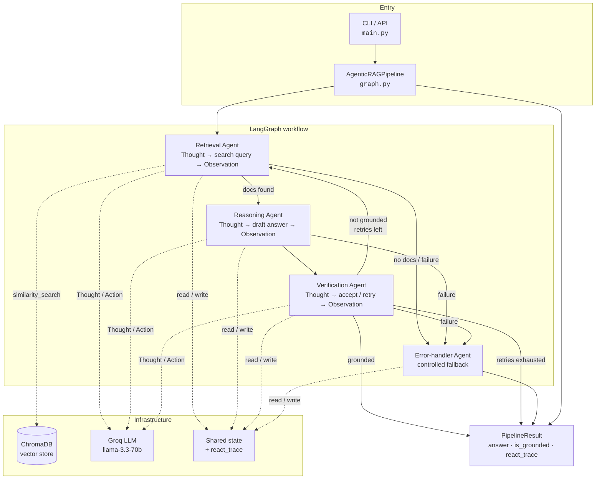
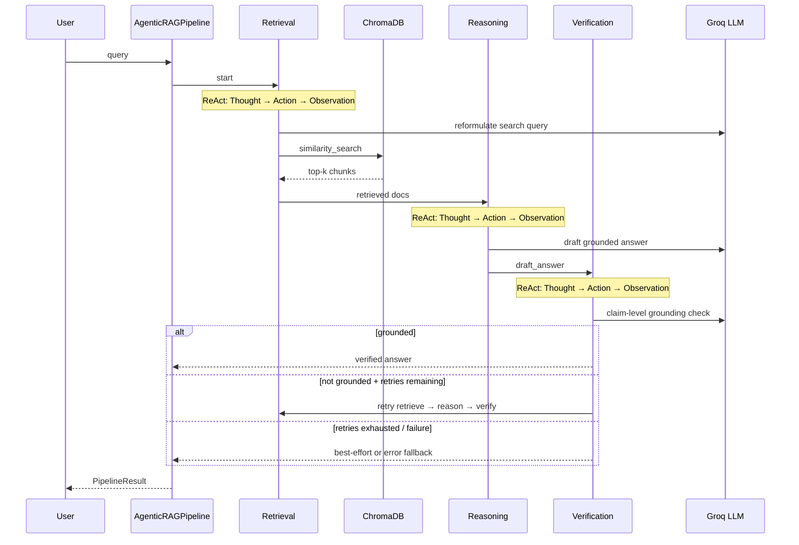

# Agentic RAG Pipeline

Enterprise-oriented multi-agent Retrieval-Augmented Generation (RAG) service built with **LangGraph**, **ChromaDB**, and **Groq** inference (`llama-3.3-70b-versatile`).

The pipeline separates retrieval, reasoning, and verification into specialized agents. Each agent executes an explicit **ReAct** cycle—**Thought → Action → Observation**—and contributes to a shared, auditable workflow state.

---

## Architecture

### System overview



### Agent workflow (happy path + retry)



### Project layout

```
AgenticRAG/
├── main.py                      # CLI entry point
├── pyproject.toml
├── requirements.txt
├── .env.example
├── README.md
├── tests/                       # Unit tests (pytest)
└── agentic_rag/
    ├── __init__.py              # Public API exports (lazy)
    ├── config.py                # Environment-backed settings (Pydantic)
    ├── exceptions.py            # Domain exception hierarchy
    ├── logging_config.py        # Structured logging
    ├── models.py                # PipelineResult / sources / metrics
    ├── metrics.py               # Latency timing helpers
    ├── state.py                 # LangGraph shared state contracts
    ├── prompts.py               # Agent system prompts
    ├── react.py                 # ReAct parsing and audit-trail helpers
    ├── routing.py               # next_action → graph node map
    ├── llm.py                   # Inference client factory
    ├── vectorstore.py           # ChromaDB persistence and search
    ├── retrieval_utils.py       # Multi-query merge helpers
    ├── retrieval.py             # Multi-query expansion + search
    ├── knowledge.py             # Reference corpus
    ├── ingest.py                # Corpus bootstrap
    ├── agents.py                # Retrieval / Reasoning / Verification / Error
    └── graph.py                 # Workflow compilation + AgenticRAGPipeline
```

### Control flow (text)

```text
Query
  └─► Retrieval Agent      (Thought → Action: vector search → Observation)
        └─► Reasoning Agent (Thought → Action: draft answer → Observation)
              └─► Verification Agent
                    ├─ grounded ──► END (verified answer)
                    └─ not grounded + retries remaining ──► Retrieval (retry)
Any node failure ──► Error-handler Agent ──► END (controlled fallback)
```

---

## Agent responsibilities

### Retrieval agent

| Step | Behavior |
|------|----------|
| Thought | Reformulates the question into an embedding-optimized search query |
| Action | Runs primary (+ optional multi-query) `similarity_search` against ChromaDB |
| Observation | Records ranked documents with scores and routes to reasoning or error handling |

### Reasoning agent

| Step | Behavior |
|------|----------|
| Thought | Maps retrieved evidence to the question and identifies gaps |
| Action | Produces a context-grounded draft answer with citations |
| Observation | Persists the draft; routes to verification (draft is never final) |

### Verification agent

| Step | Behavior |
|------|----------|
| Thought | Performs claim-level grounding analysis against retrieved context |
| Action | Accepts, corrects, or rejects the draft |
| Observation | Completes the run, or schedules a retrieval retry within configured limits |

### Error-handler agent

Produces a controlled fallback response when an upstream agent fails, preserving auditability for operators and callers.

---

## Classic RAG vs Agentic RAG

| Dimension | Classic RAG | This pipeline |
|-----------|-------------|----------------|
| Execution model | Linear retrieve → generate | Conditional multi-agent graph |
| Reasoning | Implicit inside a single generation call | Explicit `THOUGHT` per agent |
| Acting | One-shot answer generation | Tool actions (search) + draft + accept/reject |
| Observability | Limited intermediate artifacts | Full `react_trace` audit trail |
| Quality control | First generation is final | Verification gate with bounded retries |
| Failure handling | Exceptions or empty answers | Dedicated error-handler node |
| Integration surface | Ad-hoc function return | Typed `PipelineResult` |

Shared with classic RAG: document ingest, embeddings, and vector similarity search.

Differentiating capabilities: multi-agent specialization, LangGraph routing, verification loops, and structured operational telemetry.

---

## Expected results comparison

Same knowledge base, same model family. The difference is **what the caller receives** and **what can be inspected**.

### Example query

> What is Agentic RAG and how do Retrieval, Reasoning, and Verification agents work?

#### Normal (classic) RAG — expected result

```text
Pipeline:  query → similarity_search → single LLM generate → return string

Returned to caller:
  "Agentic RAG combines retrieval, reasoning, and verification using specialized
   agents. The retrieval agent fetches knowledge, the reasoning agent answers,
   and the verification agent checks accuracy."

What is typically NOT returned:
  - rewritten search query
  - intermediate draft vs final answer
  - grounding / confidence flag
  - per-step Thought → Action → Observation log
  - retry history when the first draft was weak

Limitation:
  If the model overstates or invents a detail, the first answer is still final.
```

#### Agentic RAG (this repo) — expected result

```text
Pipeline:  query → Retrieval → Reasoning → Verification → return PipelineResult

Returned to caller (PipelineResult fields):
  answer:
    "Agentic RAG systems combine Retrieval, Reasoning, and Verification using
     specialized agents. The Retrieval agent fetches relevant knowledge [12].
     The Reasoning agent performs inference and decision-making. The Verification
     agent checks results for accuracy and consistency [12]."

  search_query:           "Agentic RAG retrieval reasoning verification agents"
  draft_answer:           <first grounded draft from Reasoning agent>
  reasoning_thought:      <evidence plan, e.g. which chunks support the claim>
  verification_thought:   <claim-level grounding analysis>
  is_grounded:            true
  verification_notes:     "Claims match retrieved chunks; citations consistent."
  react_trace:            [retrieval step, reasoning step, verification step, ...]
  sources:                [{index, text, score, metadata}, ...]
  metrics:                {total_seconds, retrieval_seconds, ...}
  errors:                 []
  retry_count:            0

What this enables for reviewers:
  - see how the search query was planned (Retrieval Thought/Action)
  - separate draft from verified answer
  - confirm grounding before trusting the answer
  - audit the full ReAct trail if quality is questioned
```

### Side-by-side summary

| What a reviewer sees | Normal RAG | Agentic RAG |
|----------------------|------------|-------------|
| Final answer text | Yes | Yes (`answer`) |
| Citations / chunk refs | Sometimes (if prompted) | Encouraged in draft + verified answer |
| Search query used | Usually raw user text | Often rewritten (`search_query`) |
| Intermediate reasoning | Hidden inside one generate call | Visible (`reasoning_thought`, `react_trace`) |
| Grounding check | None | `is_grounded` + `verification_notes` |
| Retry if ungrounded | No | Yes (bounded `retry_count`) |
| Debug artifact for hiring / ops review | Final string only | Full structured `PipelineResult` |

### Second example (when quality differs)

> Query that retrieves weak or partial context

| Stage | Normal RAG expected outcome | Agentic RAG expected outcome |
|-------|----------------------------|------------------------------|
| Retrieve | Top-k chunks returned once | Same store; Retrieval agent may reformulate the query |
| Generate | One answer, possibly overconfident | Reasoning produces a **draft** only |
| Quality gate | None — answer returned as-is | Verification may set `is_grounded=false` and **retry retrieve→reason** |
| Caller sees | Single string | `answer` + `is_grounded` + `errors` / `react_trace` explaining retries |

**Takeaway for readers:** Normal RAG optimizes for a fast single-pass answer. Agentic RAG optimizes for a **reviewable, gated answer**—same corpus, richer expected result shape, and a clearer path to catch ungrounded responses.

---

## Configuration

Copy `.env.example` to `.env` and set required values:

| Variable | Description |
|----------|-------------|
| `GROQ_API_KEY` | Inference provider API key (required for query execution) |
| `GROQ_MODEL` | Model identifier (default: `llama-3.3-70b-versatile`) |
| `CHROMA_PERSIST_DIR` | Local ChromaDB persistence path |
| `CHROMA_COLLECTION` | Collection name |
| `RETRIEVAL_TOP_K` | Number of chunks retrieved per search |
| `MULTI_QUERY_ENABLED` | Expand the primary search into alternate phrasings (`true`/`false`) |
| `MULTI_QUERY_COUNT` | Number of alternate queries to generate (0 disables expansion) |
| `MAX_VERIFICATION_RETRIES` | Bound on verification-driven retries |
| `LOG_LEVEL` | `DEBUG` \| `INFO` \| `WARNING` \| `ERROR` |

---

## Installation

```bash
python3 -m venv .venv
source .venv/bin/activate
pip install -r requirements.txt
cp .env.example .env
# Set GROQ_API_KEY in .env
```

---

## Usage

### CLI

```bash
source .venv/bin/activate
python main.py "What is Agentic RAG?"
python main.py "Compare MCP and ACP" --json
python main.py --reingest --log-level DEBUG "Why use multi-agent systems?"
python main.py "What is Agentic RAG?" --show-sources --show-metrics
python main.py --batch-file queries.txt --show-metrics
```

Batch files accept one query per line; lines starting with `#` are ignored.

### Tests

```bash
pip install -e ".[dev]"
pytest
```

### Programmatic API

```python
from agentic_rag import AgenticRAGPipeline
from agentic_rag.ingest import ingest_knowledge

ingest_knowledge()
pipeline = AgenticRAGPipeline()
result = pipeline.invoke("What is Agentic RAG?")

print(result.answer)
print(result.is_grounded)
print(result.sources[0].score, result.sources[0].metadata)
print(result.metrics.total_seconds)
print(result.react_trace)
```

---

## Design notes

- **Configuration**: validated via Pydantic Settings; secrets are never hard-coded.
- **Observability**: agents emit structured logs, ReAct steps, latency metrics, and scored sources.
- **Retrieval**: optional multi-query expansion merges alternate phrasings by similarity score.
- **Resilience**: verification retries are bounded; failures route to an error-handler node.
- **API stability**: external callers should depend on `AgenticRAGPipeline` and `PipelineResult`.

## Stack

| Component | Role |
|-----------|------|
| LangGraph | Graph orchestration, shared state, conditional routing |
| ChromaDB | Persistent local vector store |
| Groq | Low-latency chat inference for agent Thought / Action steps |
| Pydantic | Settings and response validation |
